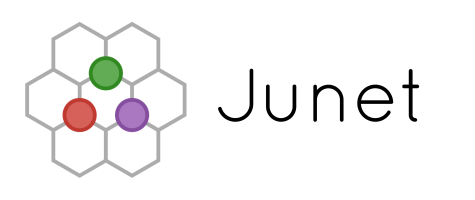
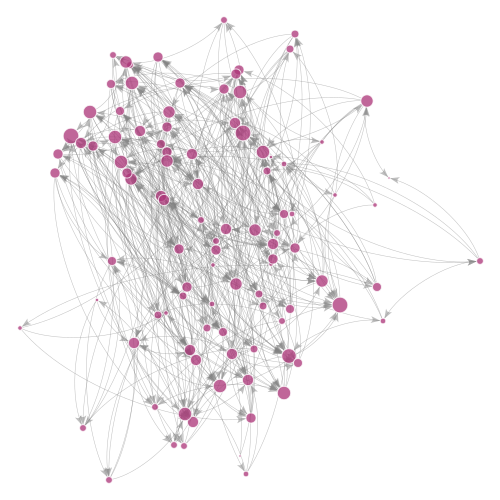

# Junet — Networks Package for Julia




Junet is a new package for network analysis that seeks
to be a fast and hackable alternative to mainstream network analysis
libraries such as NetworkX, igraph, and graph-tool.
Unlike other Julia packages, it allows to quickly traverse and modify
the graphs as well as to associate the attributes with their nodes and edges.

Currently, Junet is in *alpha* stage: many features are being ported from
experimental branches. Some things may break unexpectedly.

## Demo

```julia
using Junet

g = erdosrenyi(100, .05)

plot(g, node_size=degree(g), edge_curved=.5)
```



## Features

* Familiar syntax to manipulate graphs.

```julia
g = Graph(directed=true)  # create new graph

addnode!(g, 10)     # add 10 nodes

for i = 1:20        # add 20 random edges
    addedge!(g, rand(nodes(g), 2)...)
end

plot(g)             # layout and display the result
```

* Node and edge attributes within network objects.
They can be of arbitrary Julia types.

```julia
g[:, :size] = "a"     # add a constant attribute to all nodes

g[2:4, :size] = "b"   # change value for particular nodes

g[:, :, :weight] = 1  # add constant edge attribute

g[1, 2, :weight] = 3  # then change it for certain edge...

g[4:6, 8:10, :weight] = 2  # ... or a whole range of edges
```

What's better is that attributes are stored in sparse data structures,
which can greatly improve the memory consumption.

* Smaller data structures. By default, Junet uses `UInt32`s everywhere
and takes up to 2 times less space than libraries using `Int64`s.
Users can also strip off support for edge attributes, which gives
an additional 2x improvement.

```julia
g = Graph(nodeids=Int, edgeids=Int)  # about the same size as igraph on 64-bit machines

g = Graph(nodeids=UInt32, edgeids=UInt32)  # 2 times smaller (default)

g = Graph(nodeids=UInt32, edgeids=Void)    # 4 times smaller

g = Graph(nodeids=UInt8, edgeids=Void)     # hardly usable, but ~16x smaller!
```

* Zero-cost views on the networks

```julia
ug = undirected(g)  # network data not copied

rg = reverse(g)     # here too

dg = directed(undirected(g))   # the same as g, nothing lost in translation!
```


## Performance

Here's how Junet compares with other network analysis tools.
They all were tested on a [LiveJournal network](https://snap.stanford.edu/data/soc-LiveJournal1.html):
they had to load it into RAM and run 4 different algorithms on it.

|                  | igraph   | graph-tool | SNAP     | *Junet*  | *Junet\** | NetworkX  |
|------------------|---------:|-----------:|---------:|---------:|----------:|----------:|
| Memory           | 2,285 MB | 3.457 MB   | 5,120 MB | 2,247 MB | 591 MB    | 43,343 MB |
| Conn. Components | 3.5 s    | 3.4 s      | 22.5 s   | 3.6 s    | 2.8 s     | 35.5 s    |
| K-cores          | 6.2 s    | 3.2 s      | 39.4 s   | 9.5 s    | 8.5 s     | 349.2 s   |
| PageRank         | 22.2 s   | 50.6 s     | 250.2 s  | 24.3 s   | 17.3 s    | 625.9 s   |
| Clustering Coef. | 22.2 s   | 254.2 s    | 266.9 s  | 44.9 s   | 35.2 s    | 2804.4 s  |

\* Asterisk denotes the version with all optimizations enabled.
