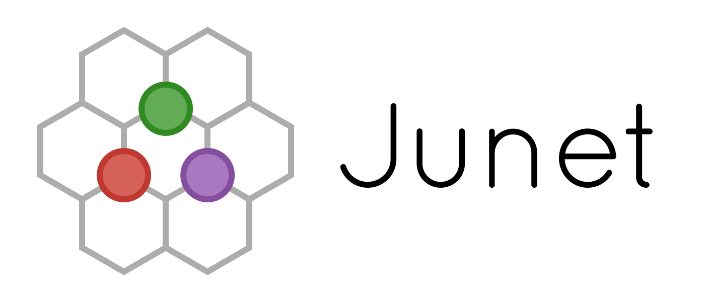
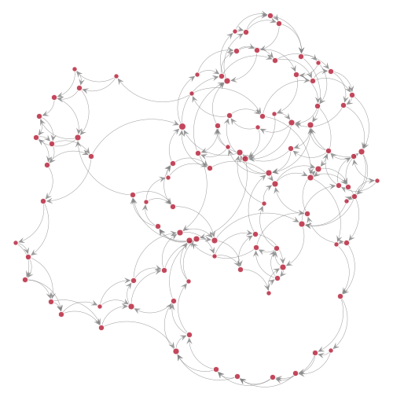

<p align="center">
  
</p>
<br>

# Junet — Networks Package for Julia

Junet is a new package for network analysis that seeks
to be a fast and hackable alternative to mainstream network analysis
libraries such as NetworkX, igraph, and graph-tool.
Unlike other Julia packages, it allows to quickly traverse and modify
the graphs as well as to associate the attributes with their nodes and edges.

Currently, Junet is in *alpha* stage: many features are being ported from
experimental branches. Some things may break unexpectedly.
To report a problem, please create an issue here. To contribute some code, please fork this repository and create a pull request.


## Demo

```julia
using Junet

g = graph_smallworld(100, 4, .1)

plot(g, node_size=10degree(g), edge_curve=.5)
```



See [more examples](https://github.com/inguar/Junet-demos).


## Features

* Familiar syntax to manipulate graphs.

```julia
g = Graph(directed=true)  # create new graph

addnode!(g, 10)     # add 10 nodes

for i = 1:20        # add 20 random edges
    addedge!(g, rand(nodes(g), 2)...)
end

plot(g)             # layout and display the result
```

* Arbitrary-typed node and edge attributes stored within network objects.

```julia
g[:, :size] = "a"     # add a constant attribute to all nodes

g[2:4, :size] = "b"   # change value for particular nodes

g[:, :, :weight] = 1  # add constant edge attribute

g[1, 2, :weight] = 3  # then change it for certain edge...

g[4:6, 8:10, :weight] = 2  # ... or a whole range of edges
```

What's better is that attributes are stored in sparse data structures,
which can greatly improve the memory consumption.

* Smaller data structures. By default, Junet uses `UInt32`s everywhere
and takes up to 2 times less space than libraries using `Int64`s.
Users can also strip off support for edge attributes, which gives
an additional 2x improvement in memory footprint.

```julia
g = Graph(TNode=Int, TEdge=Int)  # about the same size as igraph on 64-bit machines

g = Graph(TNode=UInt32, TEdge=UInt32)  # 2 times smaller (default)

g = Graph(TNode=UInt32, TEdge=Void)    # 4 times smaller

g = Graph(TNode=UInt8, TEdge=Void)     # hardly usable, but ~16x smaller!
```

* Zero-cost views on the networks, which don't copy the data.

```julia
ug = undirected(g)  # network data not copied

rg = reverse(g)     # here too

dg = directed(undirected(g))   # another object, but indistinguishable from g
```


## Performance

Here's how Junet compares with other network analysis tools.
They all are tested on a [LiveJournal network](https://snap.stanford.edu/data/soc-LiveJournal1.html):
they had to load it into RAM and run 4 different algorithms on it.

|                  | igraph   | graph-tool | SNAP     | *Junet*  | *Junet\** | NetworkX  |
|------------------|---------:|-----------:|---------:|---------:|----------:|----------:|
| Memory           | 2,285 MB | 3.457 MB   | 5,120 MB | 2,247 MB | 591 MB    | 43,343 MB |
| Conn. Components | 3.5 s    | 3.4 s      | 22.5 s   | 3.6 s    | 2.8 s     | 35.5 s    |
| K-cores          | 6.2 s    | 3.2 s      | 39.4 s   | 9.5 s    | 8.5 s     | 349.2 s   |
| PageRank         | 22.2 s   | 50.6 s     | 250.2 s  | 24.3 s   | 17.3 s    | 625.9 s   |
| Clustering Coef. | 22.2 s   | 254.2 s    | 266.9 s  | 44.9 s   | 35.2 s    | 2804.4 s  |

\* Asterisk denotes the version with RAM optimizations enabled.


## Installation

You need Julia 0.5 to run Junet. It is also forward compatible with release candidate of Julia 0.6, but it will trigger some warnings.

Once you have Julia set up, you can check out Junet from this repository (it is't added to METADATA registry yet). For that, run the following line in REPL:

```julia
julia> Pkg.clone("git://github.com/inguar/Junet.jl.git")
```

If you want to update the package, a simple `Pkg.update()` command should do that.


## Citing Junet

If you're using Junet in scientific research, here is a way to cite it:

```bibtex
@inbook{
    Zakhlebin_2017,
    author={Zakhlebin, Igor},
    title={Junet: a Julia package for network research},
    booktitle={Proceedings of 11th International AAAI Conference on Web and Social Media (ICWSM-17)},
    year={2017},
    place={Montreal, Canada},
    pages={731–732}
}
```
